#  Projeto Mininet

##  Alunos

- **João Gabriel de Carvalho Barbosa** - 1939 - GEC
- **Eduardo Augusto Fonseca Rezende** - 1938 - GEC

---

##  Topologia da Rede

**Configuração:** Topologia em árvore com profundidade 3 e ramificação 5

**Bandwidth:** 30 Mbps

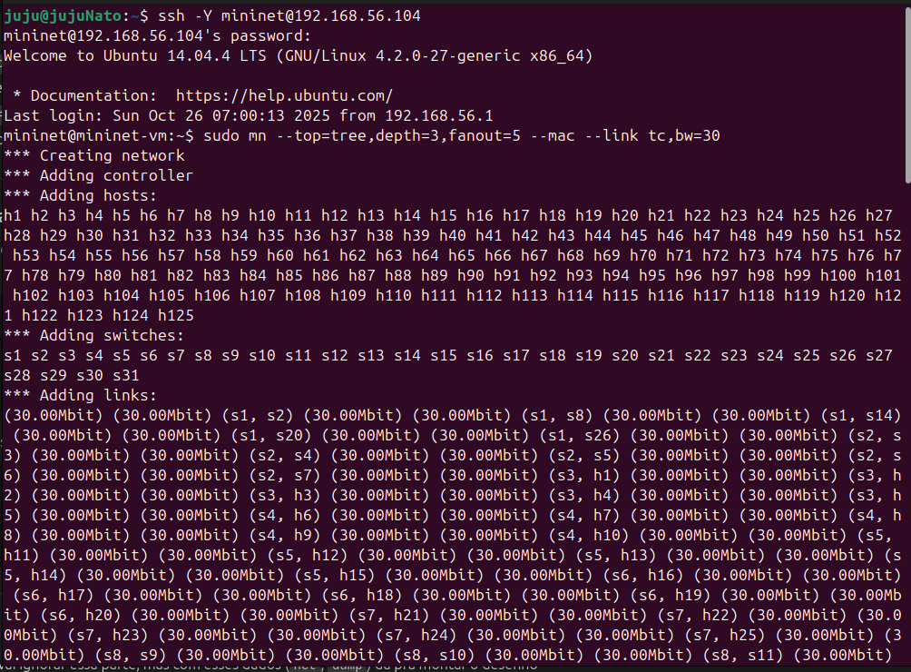

---

##  Informações das interfaces

**IfConfig h1:**

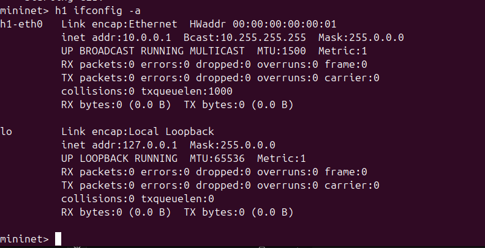

**IfConfig h2:**

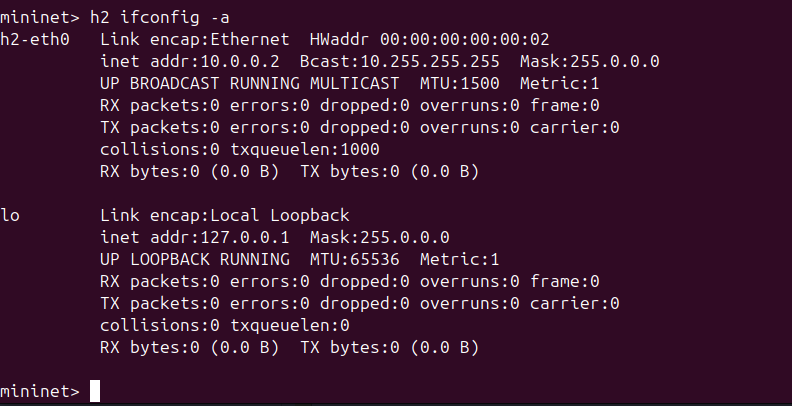

**IfConfig s1:**

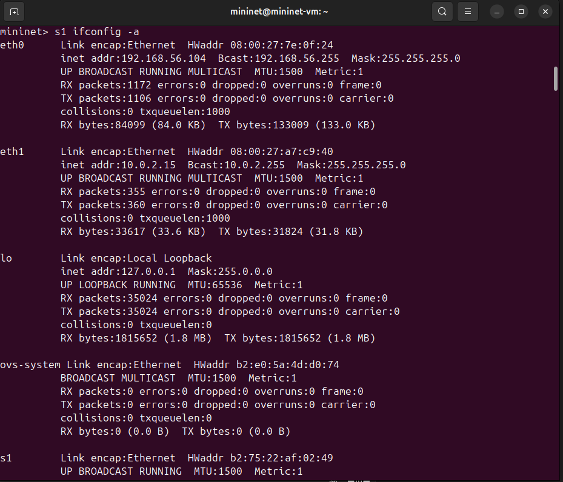

**IfConfig s2:**

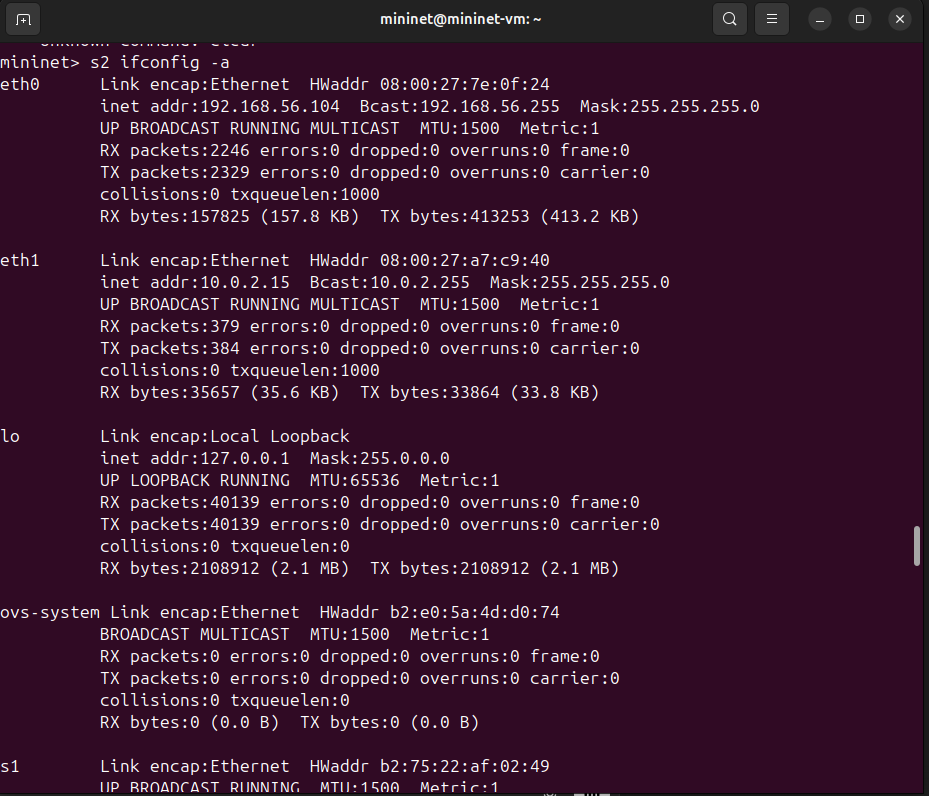

**Nodes:** 

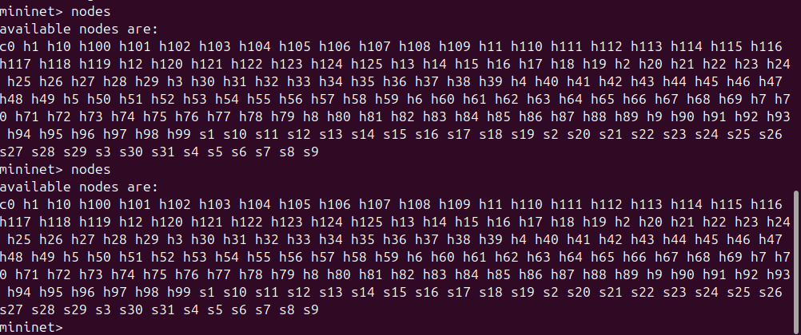

**Dump:** 

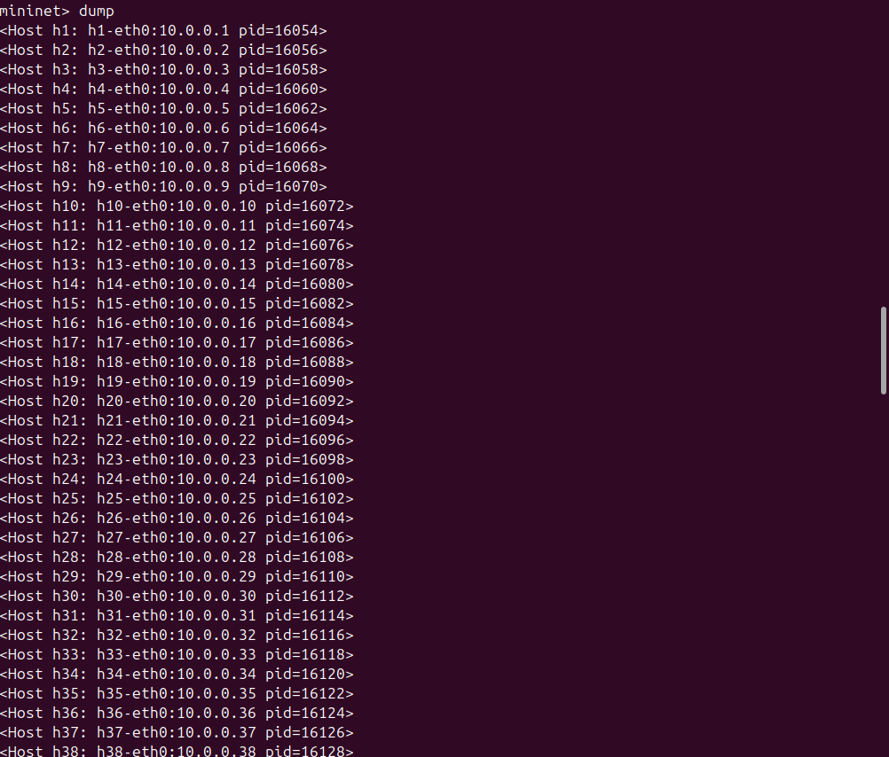

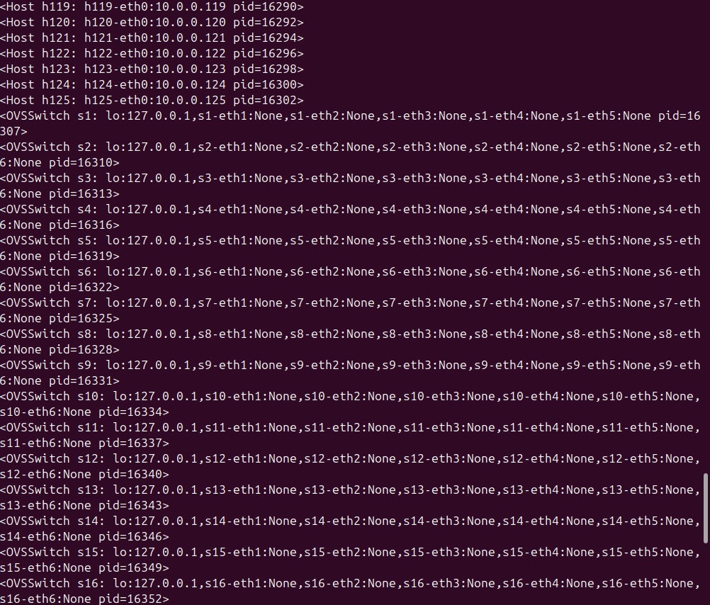

**Net:** 

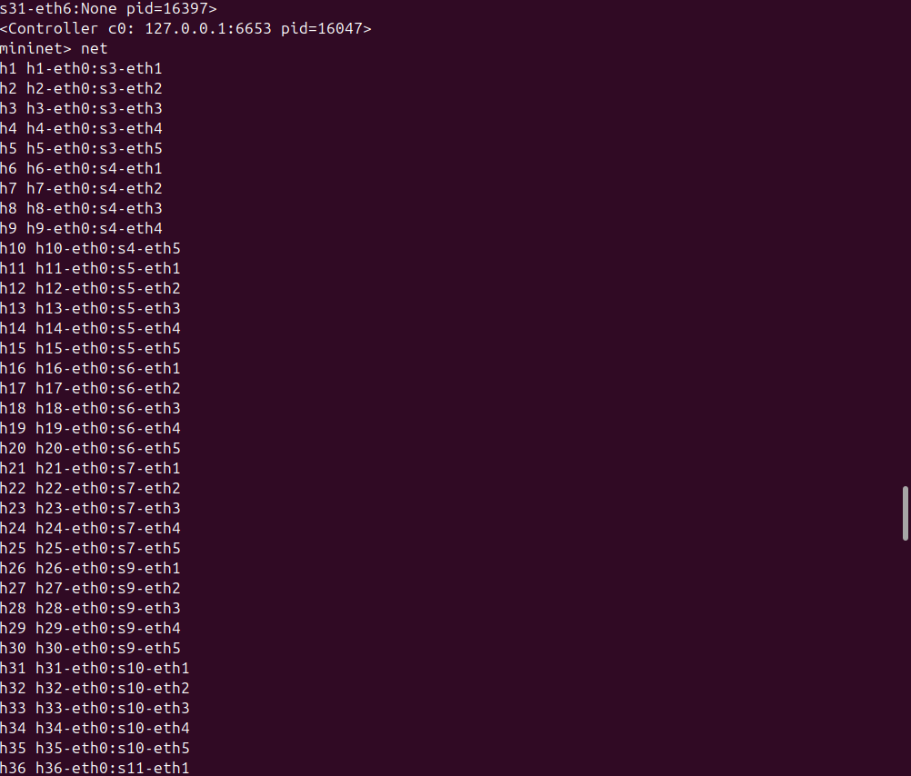

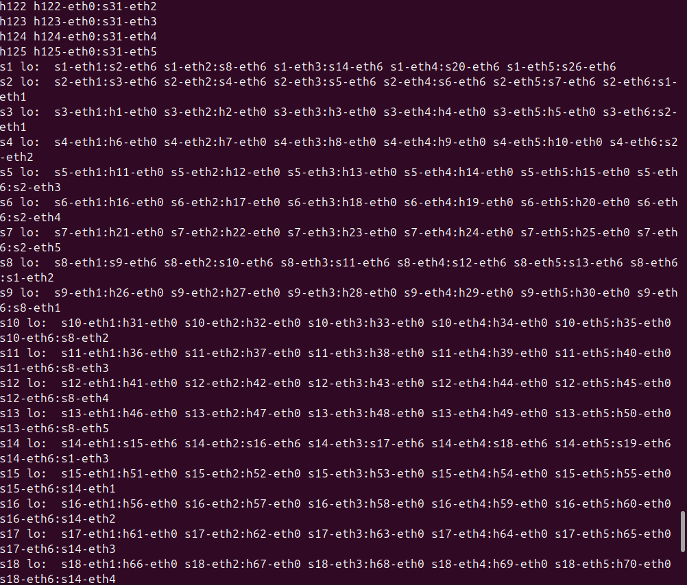

---

##  Testes de Ping

**PingAll:** 

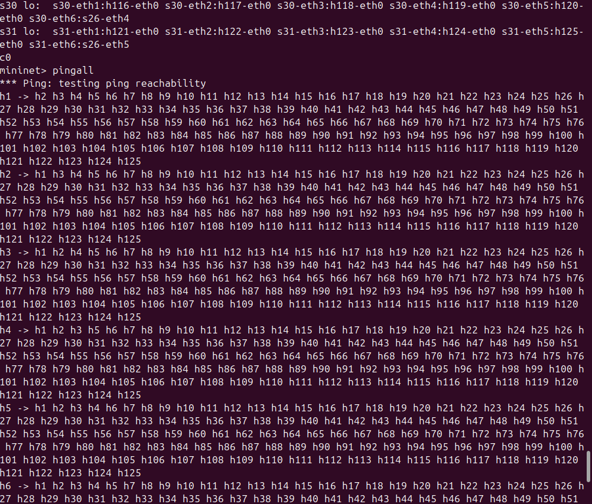

**TCPDUMP:**

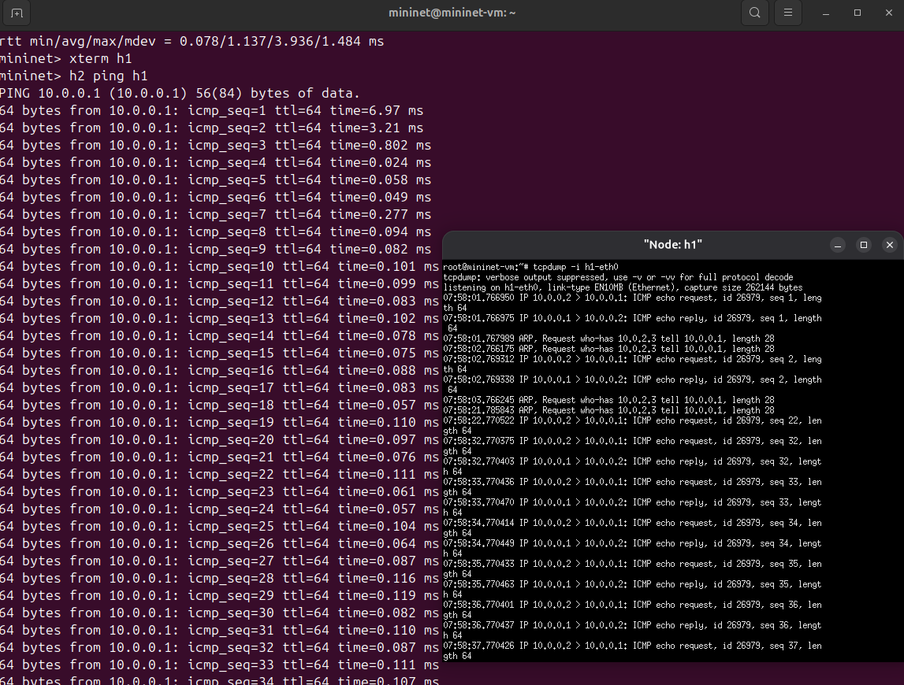

**Teste de ping h1 h2:**

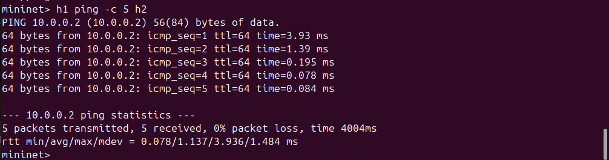

---

## Testes Iperf

**Teste iperf 30:**

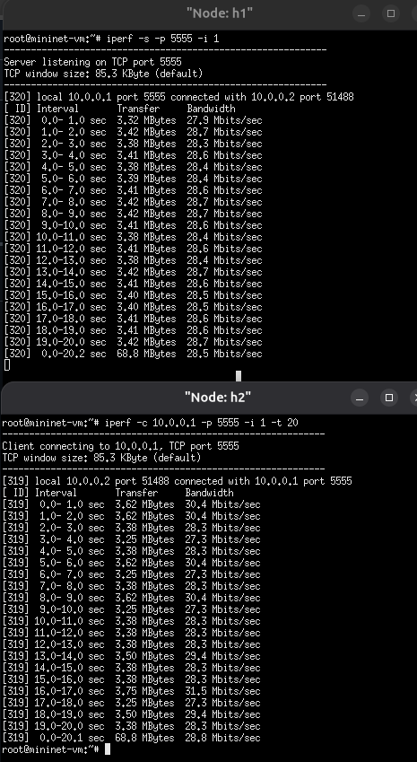

**Teste iperf 40:**

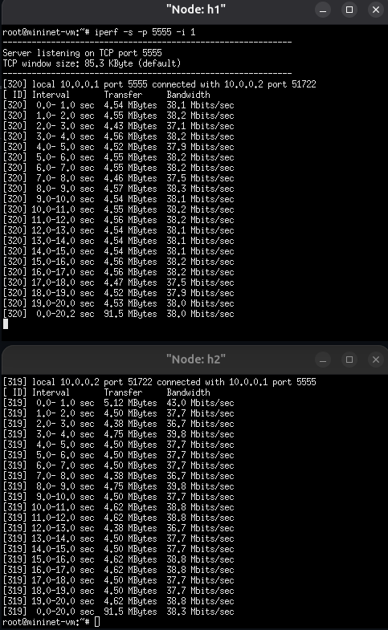