#  Projeto Mininet

##  Alunos

- **João Gabriel de Carvalho Barbosa** - 1939 - GEC
- **Eduardo Augusto Fonseca Rezende** - 1938 - GEC

---

## Parte 1 - Topologia da Rede

**Configuração:** Topologia em árvore com profundidade 3 e ramificação 5

**Bandwidth:** 30 Mbps

---

##  Informações das interfaces

**IfConfig h1:**

**IfConfig h2:**

**IfConfig s1:**

**IfConfig s2:**

**Nodes:** 

**Dump:** 

**Net:** 

---

##  Testes de Ping

**PingAll:** 

**TCPDUMP:**

**Teste de ping h1 h2:**

---

## Testes Iperf

**Teste iperf 30:**

**Teste iperf 40:**

## Desenho

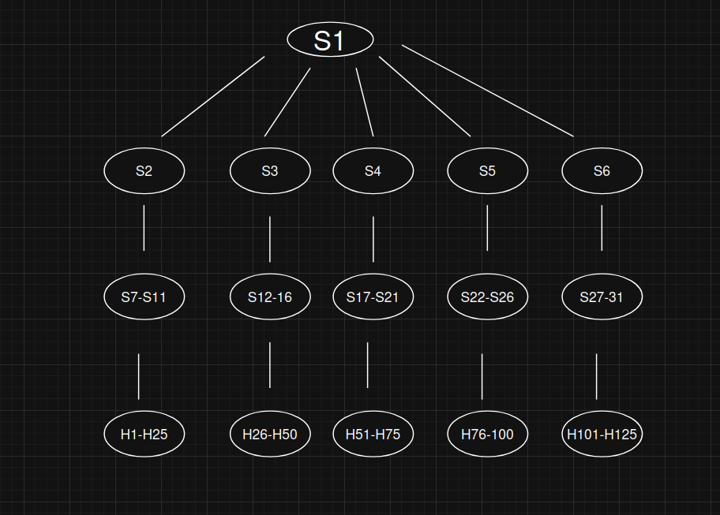

---
## Parte 2 - Topologia customizada

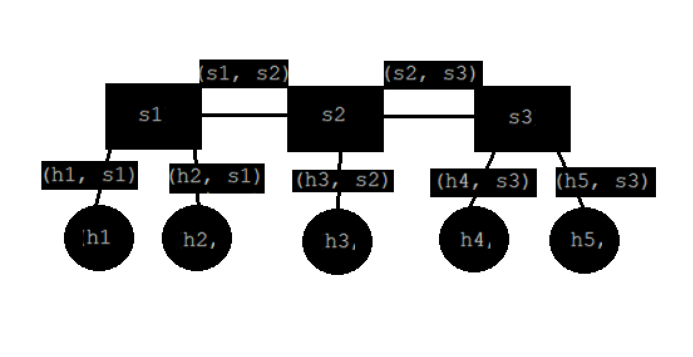

**no arquivo topo-5hosts-3sw.py você encontrará esse código código que gerou a topografia acima**

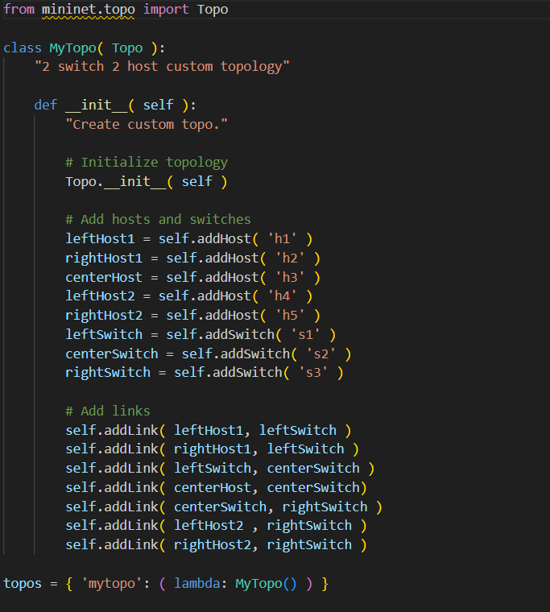

---
## Configuração do controlador

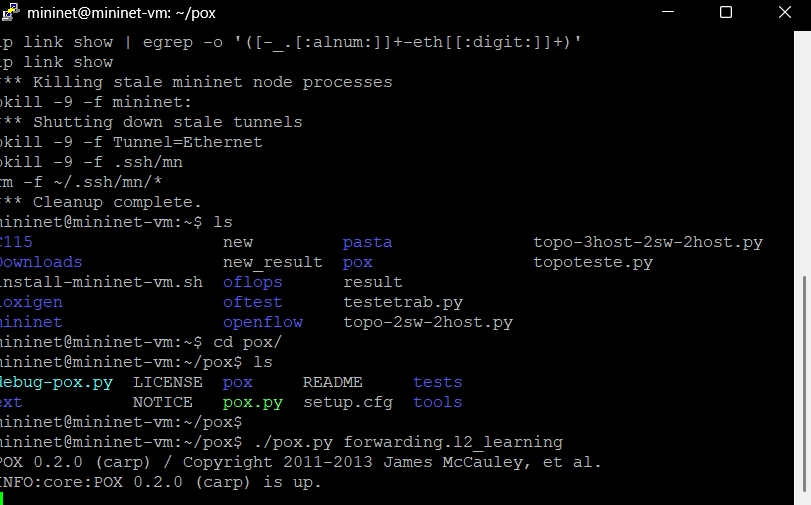

---

## Topologia e Testes

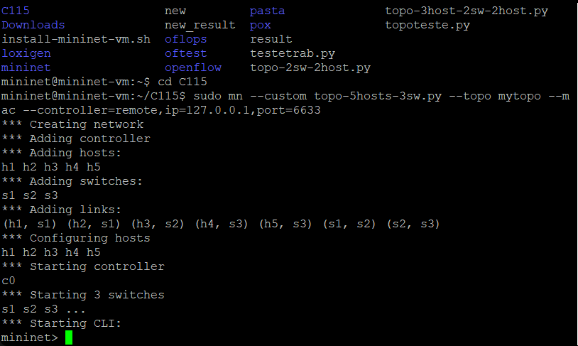

**Pingall**

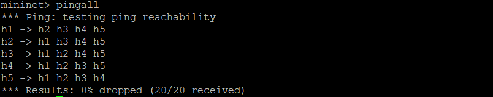

**Dump**

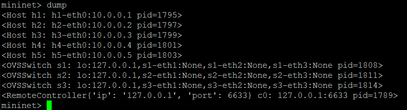

**h1 - h5**

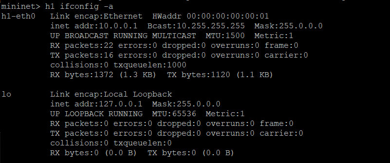

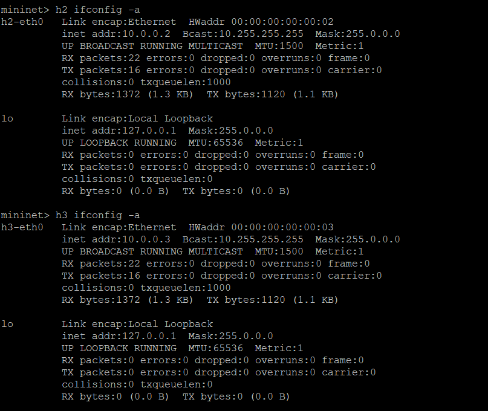

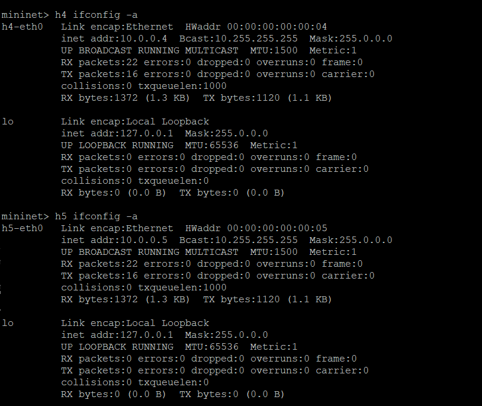

**s1**

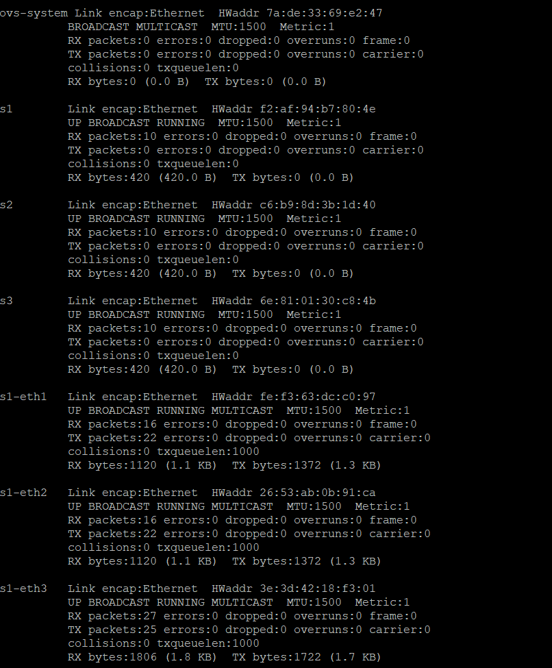

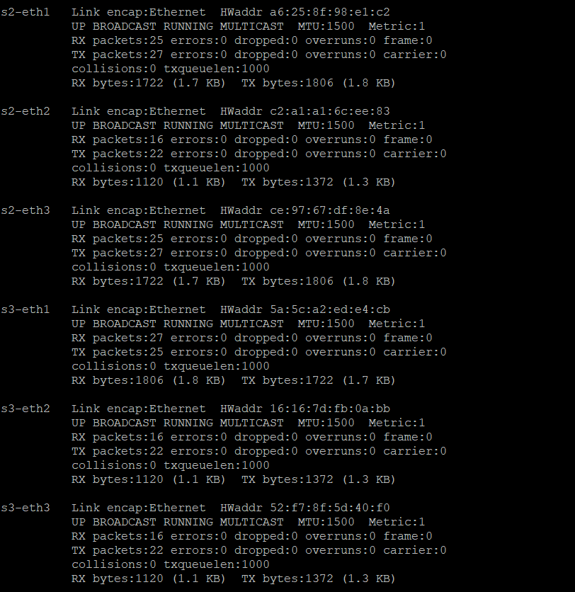

## Xming

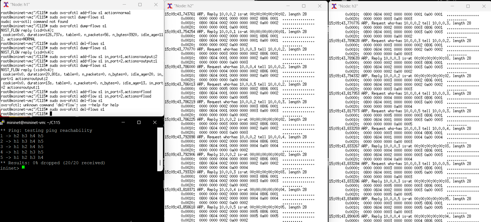